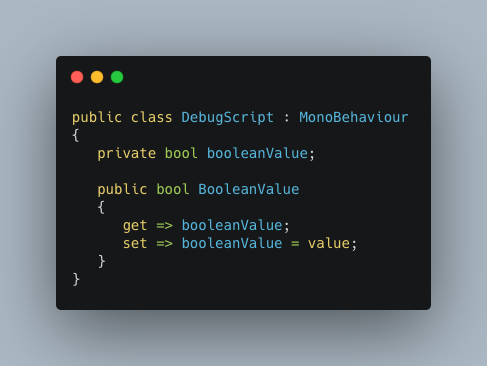
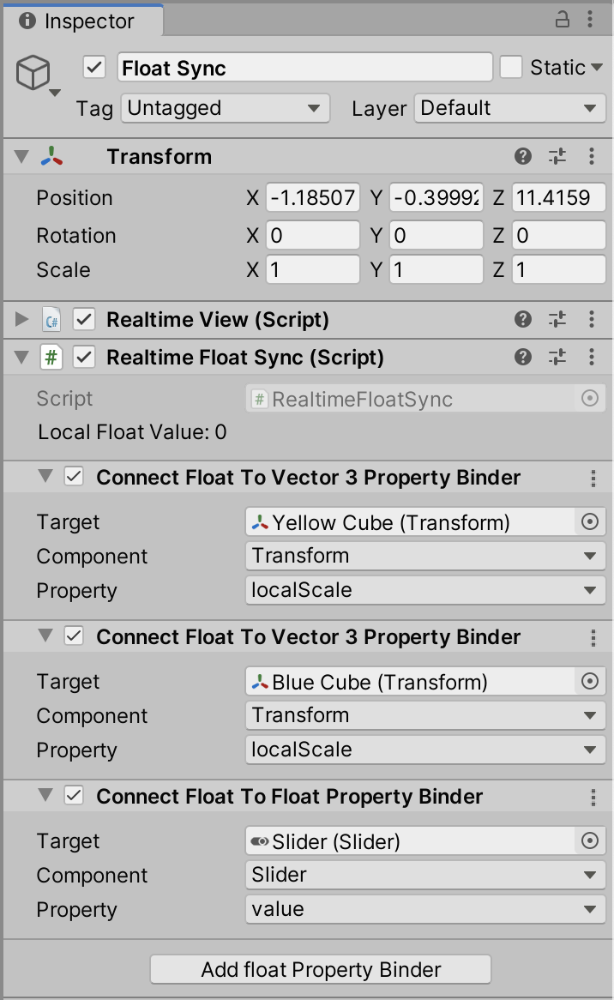

# Normcore-ParameterBinder
A Unity plugin for easily binding fundamental properties of a class to the [Normal's Normcore networking module](https://normcore.io).
The plugin provides a generic networking model that can be configured and connected to sync multiple properties of classes over the network. 

 Compatibility: Unity 2019.3 or above || Normcore 2.0
### How to use? 
---
1. Only public property can be bound. Private or public variables are not accessible to binder script. Hence convert the variables to sync into properties.  

2. For every property to sync, use the new `Realtime<T>Sync` script. If you have two float properties to sync, then use two different `RealtimeFloatSync` scripts. A single script has only one variable which syncs with the model. All the bound property hooks to this variable of the script.
  
 ** Example: Networking two different properties of `Player` Script.**
3. You can use also bind multiple properties to a single `Realtime<T>Sync` script. This will hook the values of the various properties to the value of the model. A useful feature to synchronize UI with their functionalities.   
 
** In the example below, the networked float value is bound to the `Slider`, the scale of `Yellow Cube`, and `Blue Cube`. All three will have a single value, and changing one value will affect the others. **

### FAQ:
---
1. I'm getting a bunch of package errors
This project is based on Normcore 2.0 which is currently in preview and there is constant development going on. The best way to solve those errors is to close the unity, delete the library folder, and then restarting the Unity. 

2. Timeout error
For easy out of the box play experience, I've kept my Normcore App key in the project, which means if too many people try the project, will count towards the monthly limited quota. My suggestion, use your app key. You can get it from the Normcore dashboard. 

3. Can I attach `n` different variables to a single `Realtime<T>Sync` script? 
If you intend to store different values to those variables, then use `n` different scripts. If those `n` variables will have the same value, then attach them to a single script and use binders. 

4. What is `Float to Vector3 Property Binder`? How does it work? 
I came across some use-cases which essentially uses float for vector3-(x,x,x). In such cases this is useful. If the float value changes to `x` it will update the vector to `(x,x,x)`. Vice versa if the vector's `x` property is changed to `y` then it will update the float. Note that the change in the value of `y` and `z` won't be reflected. More property binders like float to color are coming soon. 

5. ** GOT MORE QUESTIONS - Feel Free to create an issue or reach out to me at [Twitter](https://twitter.com/chetu3319)