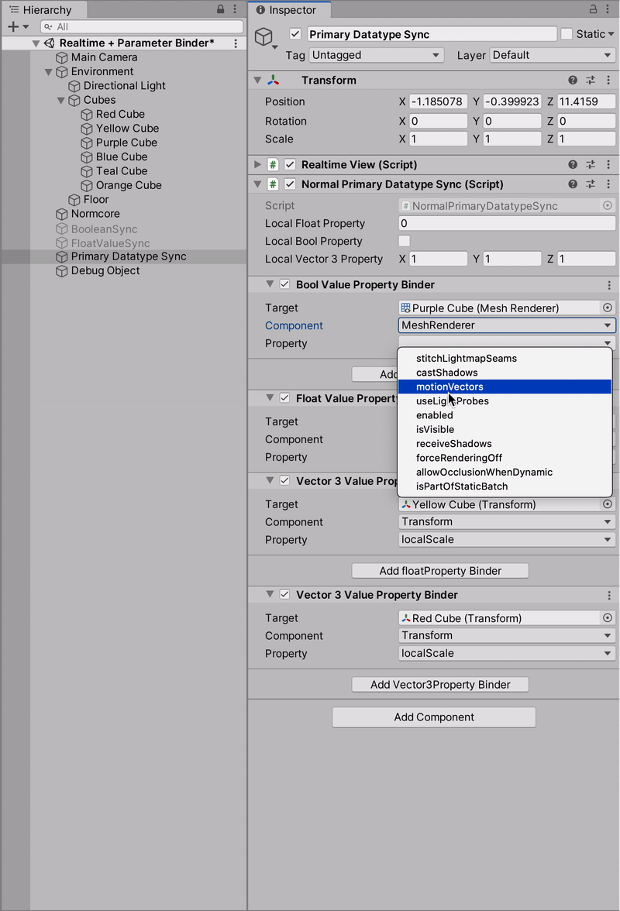

# Normcore-ParameterBinder
A Unity plugin for easily binding fundamental properties of a class to the [Normal's Normcore networking module](https://normcore.io "Title").
The plugin provides a generic networking model which can be configured and connected to sync multiple properties of classes over the network. 

### Networked Property Binder Script :  
